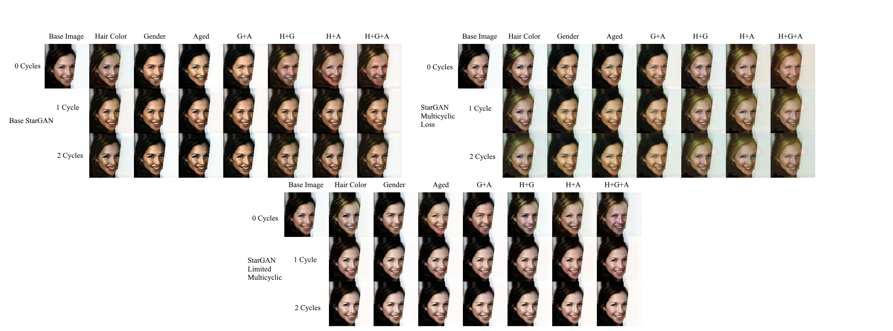

# Multicyclic Loss Project

Extending the StarGAN to care about future generations on a generated image. This project was completed as my Final Master's Project for SUNY Polytechnic

## Abstract

GANs developed to Translate an Image's style between different domains often only care about the initial translation, and not the ability to further translate upon an image This can cause issues where, if one would want to generate upon an image and then further on, change that image even more that person may come into issues. This creates a "gap" between the base images and the generated images, and in this paper a Multicyclic Loss is presented, where the Neural Network also trains on further translations to images that were already translated.

## To Run Code:
The final submitted project code for my Master's Project can be found under the FinalProject branch. In order to run the code, both a python run environment is needed, alongside several python packages that need to be installed. These packages are NumPy, Matplotlib, Pandas, and TensorFlow. The TensorFlow package also needs to be version 2.5.X, as it uses several features that were experimental but were made into base features, and as such have changed location import-wise.

To simply run the code, use the main.py script, which will ask for ids of scripts to run. To run base StarGAN, use id 3, for Limited Multicylic StarGAN, use 4, and for Full Multicyclic StarGAN use id 5. For evaluation, just simply run the evaluate.py script and fill out the prompts as needed.

In order to evaluate an LPIPS score, an external package needs to be downloaded, [https://github.com/moono/lpips-tf2.x](moono'd lpips-tf2.x). This package's code needs to be placed in an external folder in the utils folder of this model, and renamed to lpips\_tf2 to be imported correctly. However, evaluation is possible without this import, you just can't calculate the LPIPS score. 

